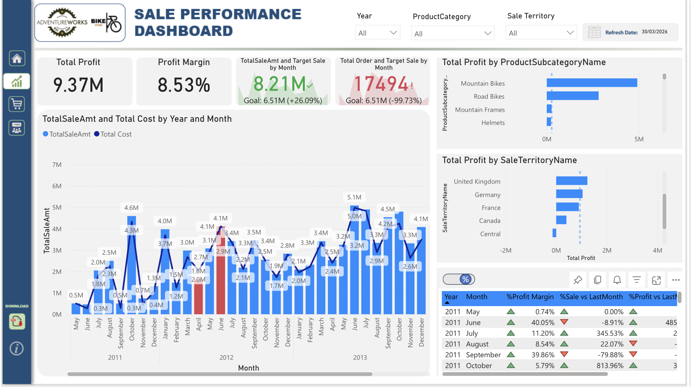

# 📊 Sales Performance Dashboard — Power BI

Interactive BI dashboard analyzing AdventureWorks sales performance 
across territories, product categories and time periods.

## 📈 Key Metrics
- **Total Profit:** $9.37M  |  **Profit Margin:** 8.53%
- **Sales vs Target:** +26.09% above goal
- Territory and product subcategory performance breakdown
- Month-over-month sales trend (2011–2013)

## 📊 Features
- DAX measures for profit margin %, MoM growth and target variance
- Dynamic slicers for Year, Product Category and Sales Territory
- Drill-through pages for territory and product deep dives
- Optimized data model for fast load performance

## 🛠️ Tools
Power BI Desktop · DAX · Data Modeling · AdventureWorks Dataset

## 🔗 Related Project
Built on top of the [AdventureWorks ETL Pipeline]
https://github.com/Dalin-2000/AdventureWorks_DWH
